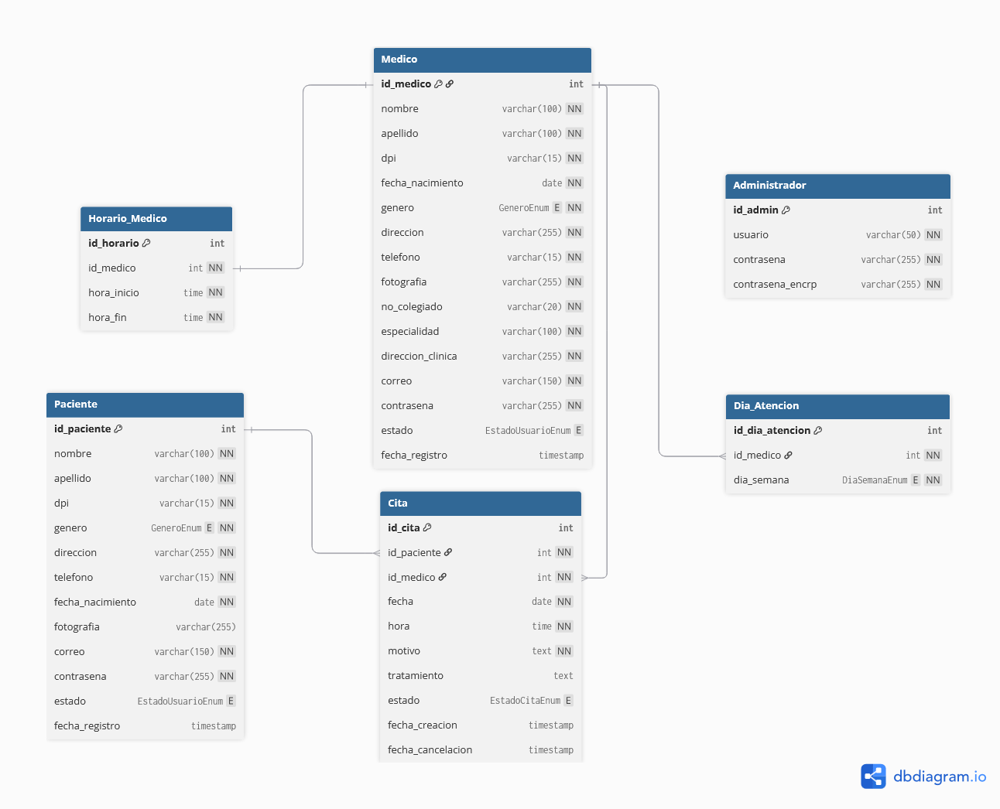

# 🗄️ Base de Datos – salud_plus

## 📌 Modelo Entidad-Relación (Modelo Físico)



> El modelo representa la estructura física de la base de datos utilizada en el proyecto **salud_plus** para la gestión de citas médicas.

> Link interactivo para ver el modelo en formato DBML: https://dbdiagram.io/d/AYD1_P1S12026-69aa4b1ca3f0aa31e1010f87 .

---

# 📖 Descripción General

La base de datos de **salud_plus** está diseñada para soportar:

- Gestión de roles de usuario (Administrador, Médico y Paciente).
- Sistema de autenticación seguro (incluyendo 2FA para administrador).
- Aprobación y gestión de estados de los usuarios.
- Configuración de horarios y días de atención médica.
- Programación, seguimiento y cancelación de citas médicas.

El motor de base de datos utilizado es:

**MYSQL 8.x**
🔗 Link de descarga: https://dev.mysql.com/downloads/installer/

---

# 🧱 Estructura de Tablas

## 🛡️ Administrador
Almacena las credenciales de los administradores del sistema, incluyendo su autenticación de dos pasos.

| Campo | Tipo | Descripción |
|-------|------|------------|
| id_admin | INT | PK (Autoincremental) |
| usuario | VARCHAR(50) | Nombre de usuario (Único) |
| contrasena | VARCHAR(255) | Contraseña encriptada principal |
| contrasena_encrp | VARCHAR(255) | Contraseña encriptada para el 2FA (auth2-ayd1.txt) |

---

## 👤 Paciente
Almacena la información personal y de acceso de los pacientes.

| Campo | Tipo | Descripción |
|-------|------|------------|
| id_paciente | INT | PK (Autoincremental) |
| nombre | VARCHAR(100) | Nombre del paciente |
| apellido | VARCHAR(100) | Apellido del paciente |
| dpi | VARCHAR(15) | Documento de Identificación (Único) |
| genero | ENUM | 'Masculino' o 'Femenino' |
| direccion | VARCHAR(255) | Dirección de residencia |
| telefono | VARCHAR(15) | Número de contacto |
| fecha_nacimiento | DATE | Fecha de nacimiento |
| fotografia | VARCHAR(255) | Ruta/URL de la foto (Opcional) |
| correo | VARCHAR(150) | Correo electrónico (Único) |
| contrasena | VARCHAR(255) | Contraseña encriptada |
| estado | ENUM | 'Pendiente', 'Aprobado', 'Rechazado', 'Desactivado' (Default: Pendiente) |
| fecha_registro | TIMESTAMP | Fecha de creación del usuario |

---

## 🩺 Medico
Almacena los datos personales y profesionales de los médicos de la plataforma.

| Campo | Tipo | Descripción |
|-------|------|------------|
| id_medico | INT | PK (Autoincremental) |
| nombre | VARCHAR(100) | Nombre del médico |
| apellido | VARCHAR(100) | Apellido del médico |
| dpi | VARCHAR(15) | Documento de Identificación (Único) |
| fecha_nacimiento | DATE | Fecha de nacimiento |
| genero | ENUM | 'Masculino' o 'Femenino' |
| direccion | VARCHAR(255) | Dirección de residencia |
| telefono | VARCHAR(15) | Número de contacto |
| fotografia | VARCHAR(255) | Ruta/URL de la foto (Obligatorio) |
| no_colegiado | VARCHAR(20) | Número de colegiado activo (Único) |
| especialidad | VARCHAR(100) | Especialidad médica |
| direccion_clinica | VARCHAR(255) | Dirección donde atiende |
| correo | VARCHAR(150) | Correo electrónico (Único) |
| contrasena | VARCHAR(255) | Contraseña encriptada |
| estado | ENUM | 'Pendiente', 'Aprobado', 'Rechazado', 'Desactivado' (Default: Pendiente) |
| fecha_registro | TIMESTAMP | Fecha de creación del usuario |

---

## 🕒 Horario_Medico
Define el rango de horas general en el que atiende un médico.

| Campo | Tipo | Descripción |
|-------|------|------------|
| id_horario | INT | PK (Autoincremental) |
| id_medico | INT | FK → Medico(id_medico) (Único) |
| hora_inicio | TIME | Hora en la que inicia labores |
| hora_fin | TIME | Hora en la que finaliza labores |

---

## 📅 Dia_Atencion
Registra los días específicos de la semana en los que el médico ofrece consultas.

| Campo | Tipo | Descripción |
|-------|------|------------|
| id_dia_atencion | INT | PK (Autoincremental) |
| id_medico | INT | FK → Medico(id_medico) |
| dia_semana | ENUM | Lunes, Martes, Miércoles, Jueves, Viernes, Sábado, Domingo |

> **Nota:** La combinación de `id_medico` y `dia_semana` es **ÚNICA** (un médico no puede registrar el mismo día dos veces).

---

## 🏥 Cita
Almacena el registro transaccional de las consultas médicas, enlazando al paciente con el médico.

| Campo | Tipo | Descripción |
|-------|------|------------|
| id_cita | INT | PK (Autoincremental) |
| id_paciente | INT | FK → Paciente(id_paciente) |
| id_medico | INT | FK → Medico(id_medico) |
| fecha | DATE | Fecha programada para la cita |
| hora | TIME | Hora exacta de la cita |
| motivo | TEXT | Razón de la consulta médica |
| tratamiento | TEXT | Receta o indicaciones (Nulo al inicio) |
| estado | ENUM | 'Pendiente', 'Atendida', 'Cancelada_Paciente', 'Cancelada_Medico' |
| fecha_creacion | TIMESTAMP | Cuándo se agendó la cita |
| fecha_cancelacion| TIMESTAMP | Fecha en la que se canceló (Opcional) |

---

# 🔗 Relaciones del Modelo

### 1️⃣ Medico → Horario_Medico
- Tipo: **1 a 1**
- Un médico tiene un único horario de atención (rango de horas) que aplica para todos sus días laborales.
- `ON DELETE CASCADE`

### 2️⃣ Medico → Dia_Atencion
- Tipo: **1 a N**
- Un médico puede atender en múltiples días de la semana.
- `ON DELETE CASCADE`

### 3️⃣ Paciente → Cita
- Tipo: **1 a N**
- Un paciente puede tener múltiples citas agendadas en el sistema.
- `ON DELETE CASCADE`

### 4️⃣ Medico → Cita
- Tipo: **1 a N**
- Un médico puede atender múltiples citas de diferentes pacientes.
- `ON DELETE CASCADE`

---

# 🚀 Cómo levantar la base de datos

## 🔹 Opción 1 – Usando MySQL desde consola

### 1️⃣ Verificar instalación e importar schema
Abrir la terminal y navegar a la carpeta raíz donde están los scripts (ej. `/database`):

```bash
mysql -u root -p < schema.sql
```

### 2️⃣ Ejecutar los datos de prueba (Mock Data)
Para problar la base de datos con los usuarios y citas iniciales para el Sprint 1:

```bash
mysql -u root -p < data.sql
```

## 🔹 Opción 2 – Usando MySQL Workbench

### Abrir MySQL Workbench.
    Conectarse a la instancia local (Local instance 3306).

    Ir a: File > Open SQL Script...

    Seleccionar el archivo schema.sql.

    Presionar el botón ⚡ (Execute).

    Repetir el proceso abriendo y ejecutando el archivo data.sql

## 🔹 Opción 3 – Usando Docker (Recomendado)
Si tienes Docker instalado, puedes levantar el motor de base de datos aislado en un contenedor:
### 1️⃣ Levantar el contenedor

```bash
docker run --name saludplus-mysql \
-e MYSQL_ROOT_PASSWORD=root \
-e MYSQL_DATABASE=salud_plus \
-p 3306:3306 \
-d mysql:8
```

### 2️⃣ Inyectar el esquema y los datos

```bash
docker exec -i saludplus-mysql mysql -u root -proot salud_plus < schema.sql
docker exec -i saludplus-mysql mysql -u root -proot salud_plus < data.sql
```

# Ejecutar motor de MYSQL (server)
# ⚠️ Recomendaciones para el Development Team

- Usar MySQL 8.x para evitar problemas de compatibilidad con ciertas sintaxis.
- No modificar el schema.sql directamente en producción o local sin antes avisar al equipo en la Daily Scrum.
- Si se agregan o quitan campos, el responsable debe actualizar el archivo SQL y la imagen del modelo ER (salud_plus_ER.png) en el repositorio.
- Recordar que la contraseña simulada en el data.sql para todos los usuarios de prueba es: Password123!