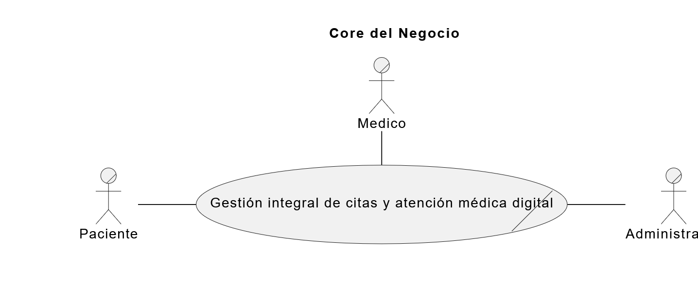
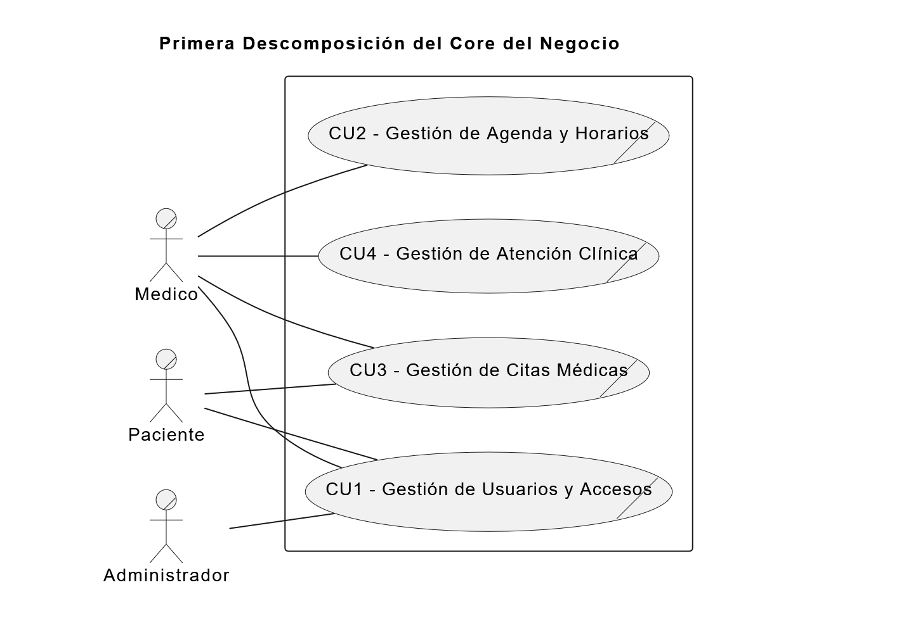

# **Identificación del Caso de Negocio**

## Core del Negocio y Primera Descomposición

---

## **Identificación del Core del Negocio**

---

### **Descripción formal del Core**
El core del negocio consiste en centralizar y digitalizar la conexión entre pacientes y médicos, garantizando un entorno seguro y estructurado para la prestación de servicios de salud. Esto se logra estandarizando el registro y verificación de usuarios, permitiendo a los médicos configurar su disponibilidad, y facilitando a los pacientes la programación, seguimiento y cancelación de citas médicas. El sistema busca optimizar el tiempo de los especialistas, llevar un control del tratamiento de los pacientes y fortalecer la administración de la clínica.

---

## **Identificación de Procesos de Negocio (Primera Descomposición)**

### **Procesos del negocio**
1. **Gestionar usuarios y accesos (Registro, autenticación, doble validación y aprobación de cuentas).**
2. **Gestionar agenda y horarios médicos (Definición de días laborales y rangos de atención).**
3. **Gestionar citas médicas (Búsqueda de especialistas, agendamiento, visualización y cancelación de reservas).**
4. **Gestionar atención clínica (Seguimiento de citas pendientes, registro de tratamientos y finalización de consultas).**

## Primera Descomposición

### **CDU de Negocio – Primera Descomposición**

---