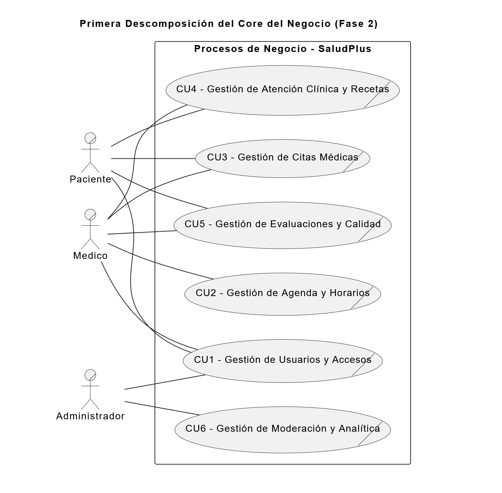
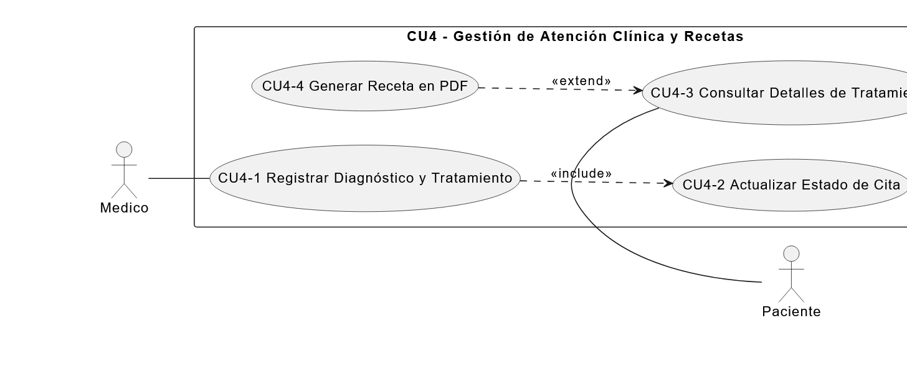

# **Identificación del Caso de Negocio**

## Core del Negocio y Primera Descomposición

---

## **Identificación del Core del Negocio**

---

### **Descripción formal del Core**
El core del negocio consiste en centralizar y digitalizar la conexión entre pacientes y médicos, garantizando un entorno seguro, estructurado y de alta calidad para la prestación de servicios de salud. Esto se logra estandarizando el registro y verificación de usuarios, facilitando la programación de citas, y **digitalizando el resultado clínico mediante recetas estructuradas**. Además, el sistema **establece un ecosistema de confianza a través de evaluaciones mutuas** y fortalece la administración de la clínica otorgando **herramientas de moderación y reportes analíticos** para la toma de decisiones.

---

## **Identificación de Procesos de Negocio (Primera Descomposición)**

### **Procesos del negocio**
1. **Gestionar usuarios y accesos:** Registro, autenticación, validación documental y gestión de estados de usuarios (aprobación/baja).
2. **Gestionar agenda y horarios médicos:** Definición de días laborales y rangos de atención.
3. **Gestionar citas médicas:** Búsqueda de especialistas, agendamiento y seguimiento de reservas.
4. **Gestionar atención clínica y recetas:** Registro de diagnósticos, estructuración de tratamientos médicos y emisión/impresión de recetas en PDF.
5. **Gestionar evaluaciones y calidad:** Sistema cruzado de calificaciones (estrellas) y emisión de reportes por faltas de conducta entre pacientes y médicos.
6. **Gestión de moderación y analítica:** Revisión de denuncias, aplicación de medidas disciplinarias y generación de reportes estadísticos para el negocio.

## Primera Descomposición

### **CDU de Negocio – Primera Descomposición**

---

## **CU4 - Gestión de Atención Clínica y Recetas**

Este proceso de negocio gestiona la culminación de la consulta médica y la entrega de resultados tangibles al paciente. Abarca el momento en que el profesional de la salud registra de manera estructurada el diagnóstico clínico y los medicamentos recetados (con sus respectivas dosis, cantidades y tiempos), asegurando la claridad de las instrucciones. 

Además, contempla el cambio automático del estado de la cita a "Atendida" y faculta al paciente para consultar su historial médico en cualquier momento. Finalmente, incluye la digitalización del tratamiento mediante la generación de un documento PDF estandarizado (receta médica) que el paciente puede descargar o imprimir para adquirir sus medicamentos, cerrando así el ciclo de atención clínica de forma eficiente y segura.

### **CDU Expandidos identificados**

* CU4-1 Registrar Diagnóstico y Tratamiento
* CU4-2 Actualizar Estado de Cita
* CU4-3 Consultar Detalles de Tratamiento
* CU4-4 Generar Receta en PDF

### **Trazabilidad**

* HU-015, HU-016
* RF-007, RF-008
* RR-005

---

### **Diagrama CDU Expandido – CU4**

