# Prototipos de Interfaces - Fase 2 - SaludPlus

El diseño visual de esta segunda fase se enfocó en la integración de herramientas de control de calidad, evaluación mutua, gestión avanzada por parte del administrador y la digitalización estructurada de recetas médicas, garantizando una experiencia intuitiva para todos los roles.

---

## 1. Módulo del Administrador

Interfaces diseñadas para la moderación del sistema, control de usuarios y visualización de métricas clave para la toma de decisiones.

### 1.1. Aprobación y Rechazo de Usuarios
Pantalla donde el administrador revisa las solicitudes de nuevos médicos y pacientes. Incluye el visor de documentos embebido (DPI/CV) para validar la información antes de aprobar o rechazar el registro.
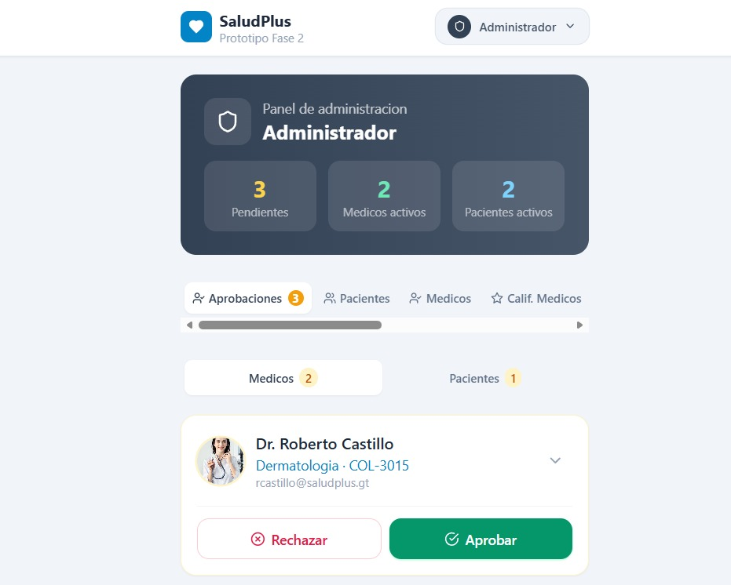

### 1.2. Gestión de Usuarios Activos (Dar de baja)
Lista detallada del directorio de pacientes y médicos ya aceptados en la plataforma. Permite la edición de perfiles y cuenta con controles de seguridad para dar de baja (desactivar) a usuarios infractores.
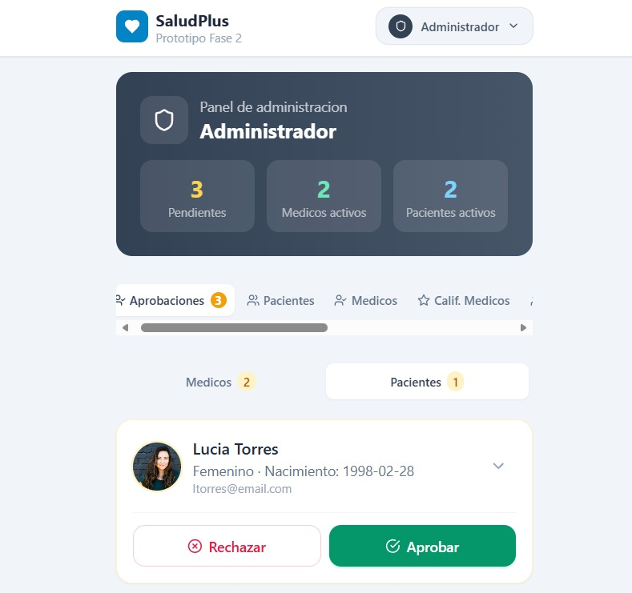

### 1.3. Top Mejores Médicos Calificados
Reporte analítico que muestra un ranking o tabla de posiciones con los médicos mejor evaluados por los pacientes, destacando su promedio global de estrellas.
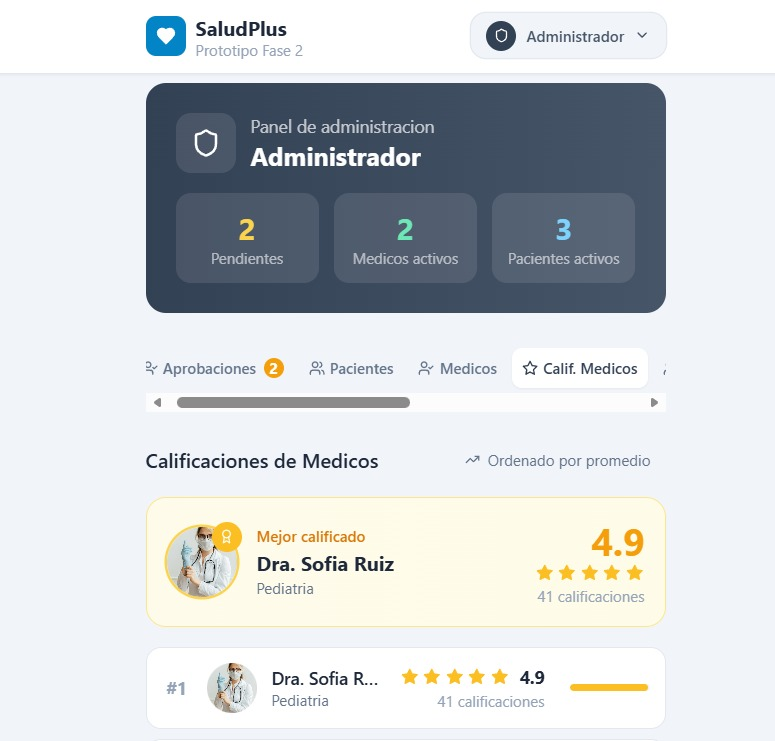

### 1.4. Reportes Generales y Estadísticas
Panel gerencial (Dashboard) que consolida métricas clave sobre el uso de la plataforma, permitiendo la visualización de datos estadísticos mediante gráficas dinámicas.
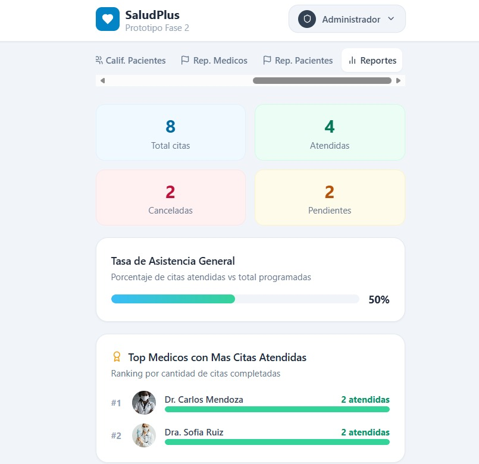

---

## 2. Módulo del Paciente

Pantallas enfocadas en la revisión del historial clínico y el ecosistema de retroalimentación hacia los médicos.

### 2.1. Historial de Citas Atendidas
Vista personal del paciente donde puede consultar el registro cronológico de sus consultas pasadas, revisar los diagnósticos recibidos y verificar si la cita ya fue calificada.
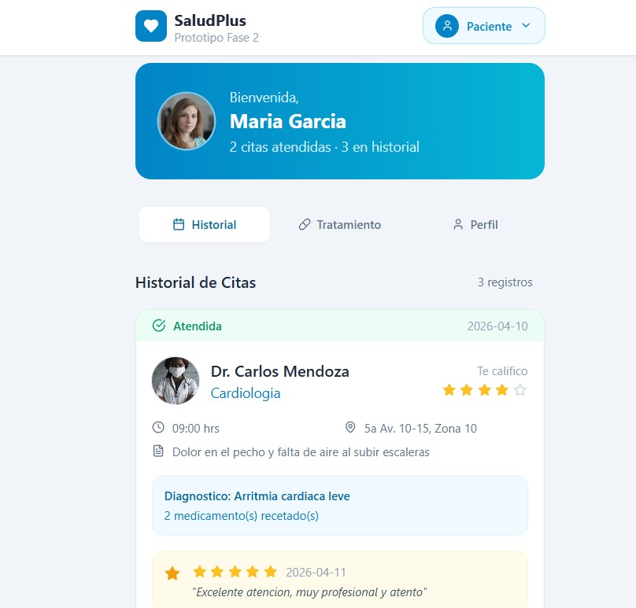

### 2.2. Evaluación y Calificación del Médico
Modal o interfaz sencilla que permite al paciente asignar una calificación (de 0 a 5 estrellas) y redactar un comentario sobre la atención recibida en su cita.
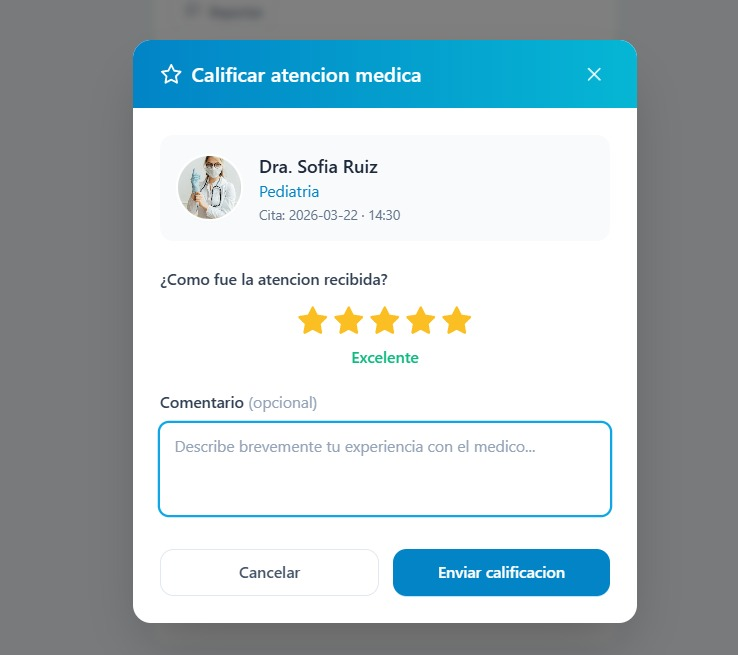

### 2.3. Formulario de Reportes de Conducta
Formulario estructurado para enviar denuncias formales al administrador seleccionando una categoría predefinida y detallando lo ocurrido. *(Nota: Esta interfaz y flujo funcional aplica exactamente igual cuando un médico necesita reportar a un paciente).*
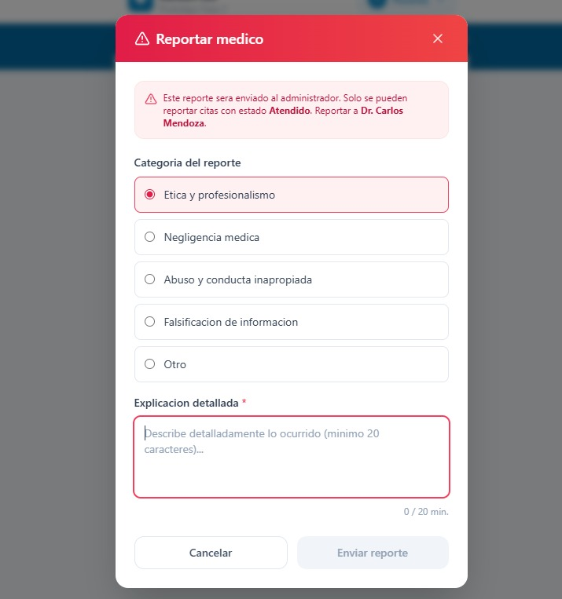

---

## 3. Módulo del Médico

Herramientas clínicas diseñadas para optimizar el registro de la consulta y generar documentos oficiales legibles.

### 3.1. Panel de Citas Pendientes a Atender
Vista actualizada de la agenda del médico, mostrando la lista de pacientes listos para ser atendidos en el día con botones de acción directa para iniciar la consulta.
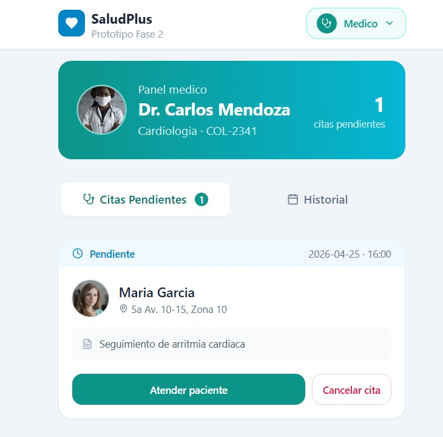

### 3.2. Módulo Estructurado de Recetas y Tratamiento
Interfaz clínica que exige el ingreso de un diagnóstico y permite agregar dinámicamente uno o múltiples medicamentos (indicando nombre, cantidad, dosis y duración) para el paciente.
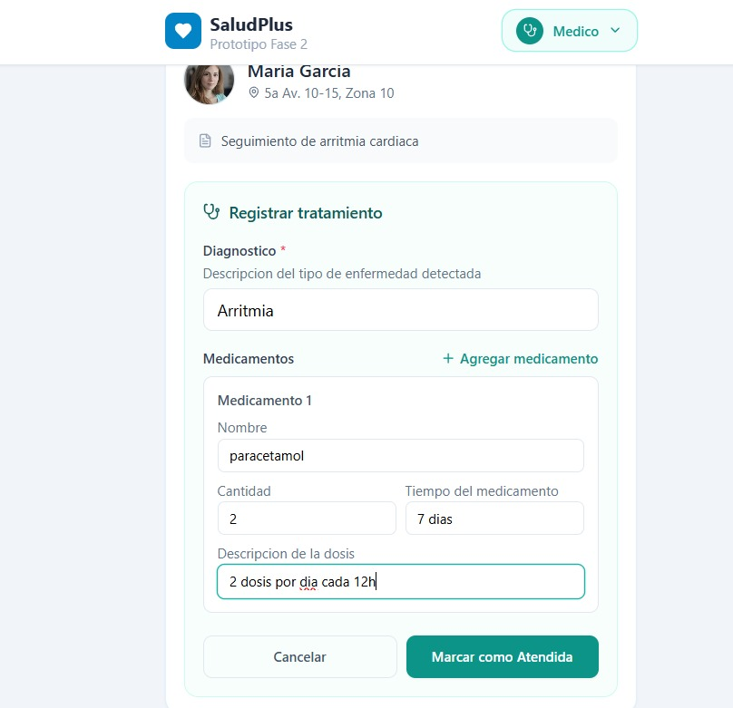

### 3.3. Generación de Receta en PDF
Vista previa del documento final generado por el sistema. Muestra el diseño estandarizado de la receta (encabezado, tabla de medicinas y firma), lista para ser descargada o impresa.
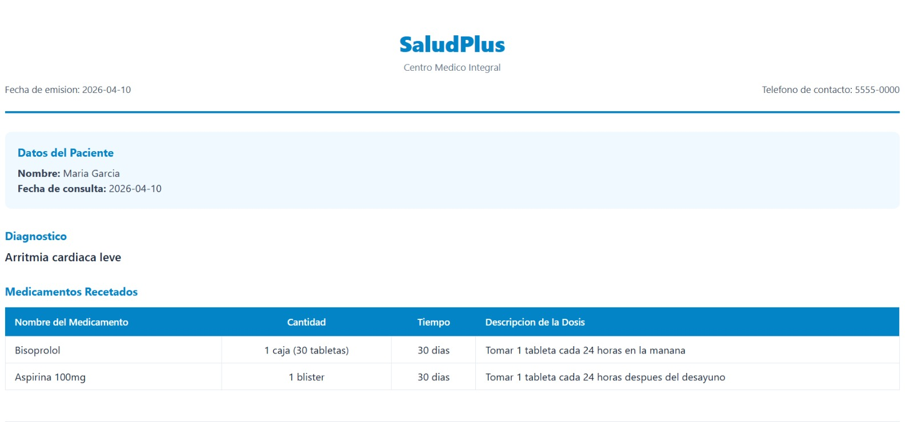

### 3.4. Reporte General del Médico
Pantalla de resumen estadístico personal para el profesional de la salud, mostrando métricas de su rendimiento, citas atendidas, calificaciones recibidas, entre otros datos.
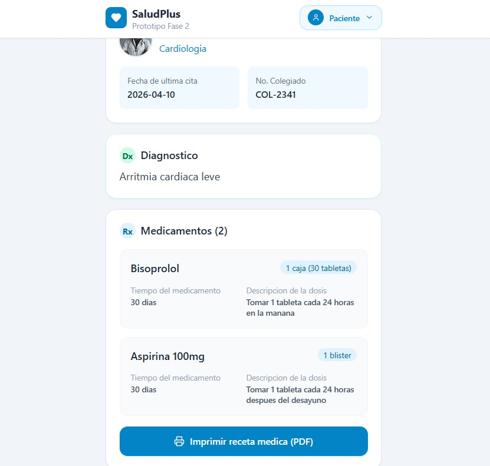