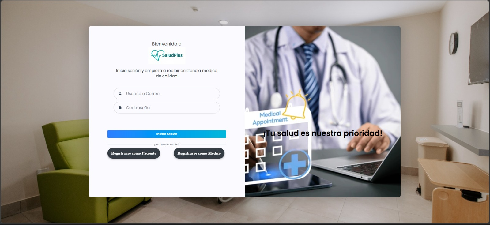
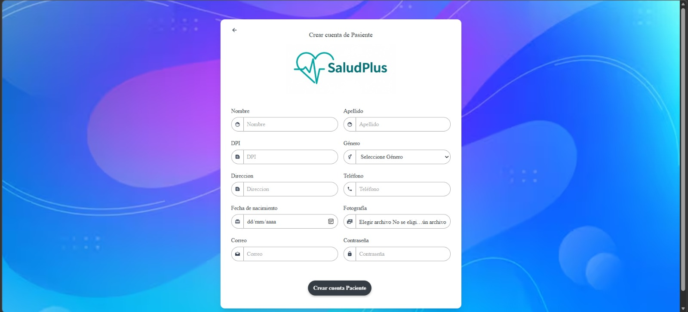
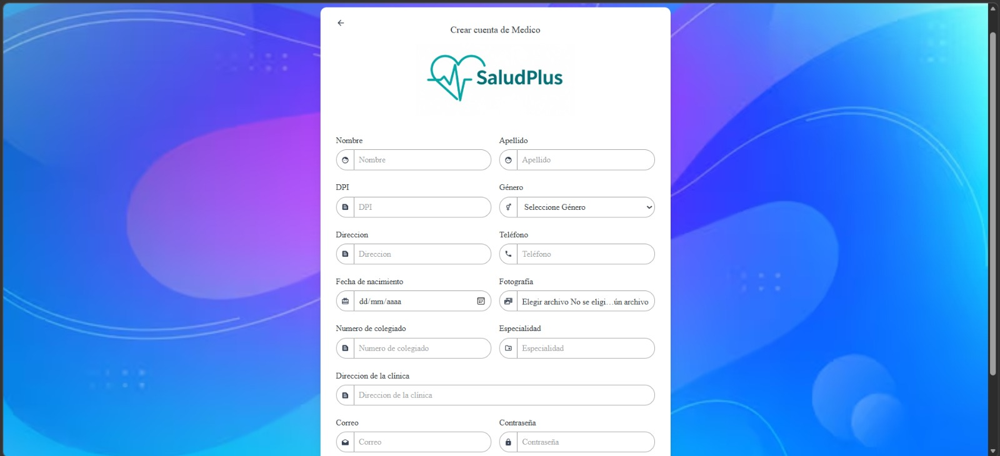
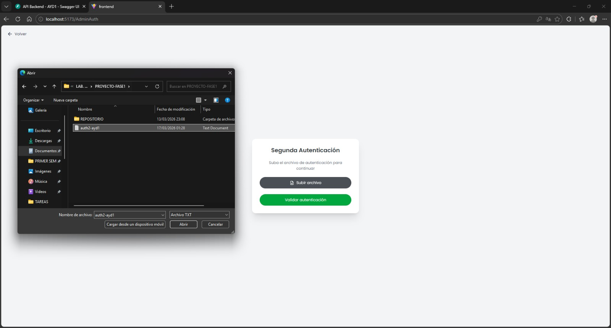
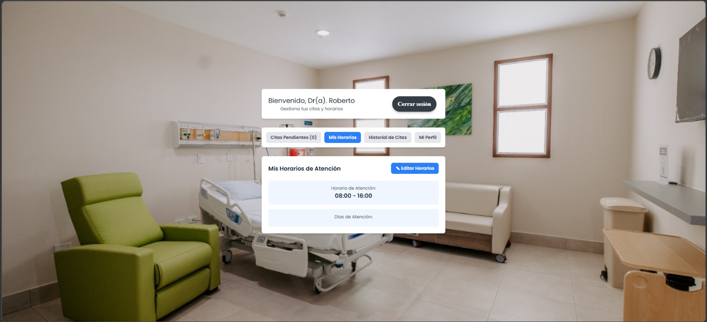
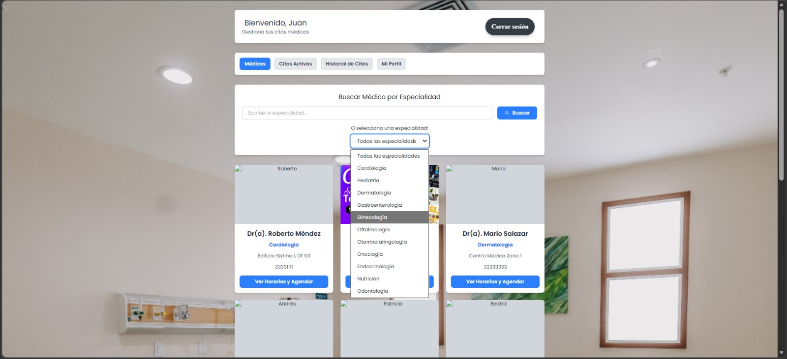
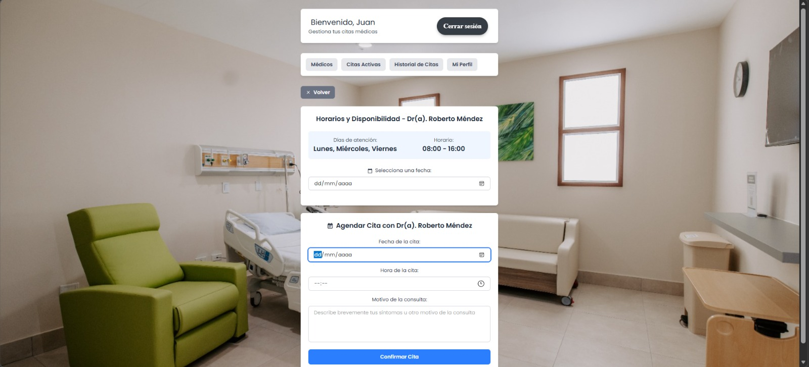
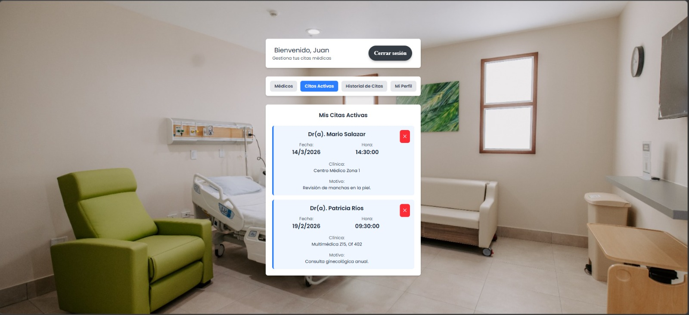

# Prototipos de Interfaces (UI) - SaludPlus

El diseño visual final que se enfocó en mantener una interfaz limpia, intuitiva y accesible, garantizando una excelente experiencia de usuario (UX) para los tres roles del sistema: Pacientes, Médicos y Administrador.

---

## 1. Módulo de Autenticación y Registro

Esta sección abarca las pantallas iniciales donde los usuarios interactúan por primera vez con la plataforma.

### 1.1. Inicio de Sesión (Login)
Vista principal donde pacientes y médicos ingresan sus credenciales. Incluye validaciones visuales y el enlace de redirección para usuarios nuevos.

### 1.2. Registro de Paciente
Formulario estructurado para capturar los datos personales del paciente. Se incluyeron indicadores de seguridad para la contraseña y carga de fotografía opcional.

### 1.3. Registro de Médico
Formulario especializado que incluye campos profesionales (No. de colegiado, especialidad, dirección de clínica) y el campo obligatorio para la fotografía.

---

## 2. Módulo del Administrador

Interfaces diseñadas con un enfoque de control y gestión para garantizar la seguridad de la plataforma.

### 2.1. Login de Doble Factor (2FA)
Pantalla de seguridad adicional exclusiva para el administrador, donde se le solicita cargar el archivo `auth2-ayd1.txt` para completar la autenticación.

---

## 3. Módulo del Médico

Herramientas enfocadas en la organización de la agenda y la atención rápida de los pacientes.

### 3.1. Configuración de Horario y Días de Atención
Interfaz sencilla mediante selectores y casillas de verificación (checkboxes) para que el médico establezca sus días laborales y el rango de horario general.

### 3.2. Panel de Citas Pendientes
Vista que enlista cronológicamente los pacientes programados para el día o la semana. Incluye la información clave: Fecha, hora, nombre y motivo de la consulta.

### 3.3. Modal de Atención y Tratamiento
Ventana emergente que se despliega al hacer clic en "Atendido", permitiendo al médico redactar las indicaciones o el tratamiento final para cerrar el ciclo de la cita.

---

## 4. Módulo del Paciente

Interfaces orientadas a la búsqueda fácil y la auto-gestión de salud.

### 4.1. Catálogo de Médicos (Dashboard)
Página principal del paciente tras iniciar sesión. Muestra tarjetas con la foto, especialidad y datos de cada médico aprobado. Incluye una barra de búsqueda/ComboBox superior para filtrar por especialidad.

### 4.2. Agendar Cita
Interfaz de selección de fecha y hora basada en la disponibilidad real del médico seleccionado. Incluye un área de texto para que el paciente describa el motivo de su consulta.

### 4.3. Mis Citas Activas
Historial y agenda personal del paciente. Muestra sus citas futuras confirmadas y proporciona un botón de fácil acceso para cancelar la reserva (con su respectiva confirmación de seguridad).
