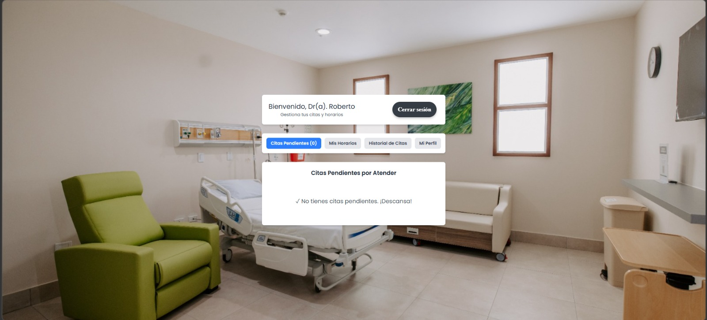

# Manual de Usuario - SaludPlus

¡Bienvenido a **SaludPlus**! Esta plataforma ha sido diseñada para facilitar la conexión entre pacientes y profesionales de la salud, permitiendo agendar, gestionar y atender citas médicas de manera rápida y segura.

Este manual le guiará paso a paso en el uso de la aplicación dependiendo de su rol: **Paciente**, **Médico** o **Administrador**.

---

## 1. Ingreso y Registro (Para todos los usuarios)

### 1.1. ¿Cómo registrarse en SaludPlus?
Si es su primera vez en la plataforma, debe crear una cuenta.
1. En la pantalla principal, haga clic en el enlace **"¿No tienes cuenta? Regístrate aquí"**.
2. Seleccione su rol: **Soy Paciente** o **Soy Médico**.
3. Llene el formulario con sus datos reales (DPI, Nombre, Correo, etc.).
   * *Nota para Médicos:* Deberá ingresar su número de colegiado y subir una fotografía obligatoria.
4. Cree una contraseña segura (mínimo 8 caracteres, incluyendo una mayúscula, una minúscula y un número).
5. Haga clic en **"Registrarse"**.
   * *Importante:* Su cuenta quedará en estado "Pendiente". Un administrador deberá aprobarla antes de que pueda iniciar sesión.

### 1.1. Iniciar Sesión
Una vez que su cuenta haya sido aprobada:
1. Ingrese su correo electrónico y su contraseña en la pantalla principal.
2. Haga clic en **"Iniciar Sesión"**.
3. El sistema lo redirigirá automáticamente a su panel correspondiente.

---

## 2. Guía para Pacientes

Como paciente, usted puede buscar médicos especialistas y agendar sus consultas.

### 2.1. Buscar y Filtrar Médicos
Al iniciar sesión, verá el catálogo de médicos disponibles.
1. Utilice la barra de búsqueda o el filtro de **"Especialidad"** en la parte superior para encontrar al médico adecuado.
2. Verá la fotografía, nombre, especialidad y dirección de la clínica de cada doctor.

### 2.2. Agendar una Cita Médica
1. En la tarjeta del médico de su elección, haga clic en **"Agendar Cita"**.
2. Se abrirá un calendario con los días y horarios disponibles del médico. Seleccione la fecha y hora que mejor le convenga.
3. Escriba el **motivo** de su consulta en el cuadro de texto.
4. Haga clic en **"Confirmar Cita"**.
   * *Nota:* No puede agendar dos citas a la misma hora, ni tener más de una cita pendiente con el mismo doctor al mismo tiempo.

### 2.3. Ver y Cancelar mis Citas
1. Diríjase a la pestaña **"Mis Citas"**. Aquí verá la lista de citas que tiene programadas.
2. Si por algún motivo no puede asistir, haga clic en el botón rojo **"Cancelar"**.
3. Confirme su decisión en la ventana emergente. La cita será eliminada de su agenda.

---

## 3. Guía para Médicos

Como médico, su panel le permite controlar su disponibilidad y llevar el registro de sus consultas.

### 3.1. Configurar Horarios y Días de Atención
Para que los pacientes puedan agendar citas con usted, primero debe establecer cuándo trabaja.
1. Vaya a la sección de **"Mi Horario"** o **"Configuración"**.
2. Seleccione los **días de la semana** que atiende (ej. Lunes a Viernes).
3. Establezca su rango de horario (ej. 08:00 AM a 04:00 PM).
4. Guarde los cambios. 
   * *Nota:* Si intenta cambiar su horario y tiene citas previamente agendadas fuera del nuevo rango, el sistema le pedirá que primero atienda o cancele esas citas.

### 3.2. Atender Pacientes
1. En su panel principal, verá la lista de **Citas Pendientes** ordenadas por fecha.
2. Verá la fecha, hora, nombre del paciente y el motivo de la consulta.
3. Una vez finalizada la consulta con el paciente, haga clic en el botón verde **"Atendido"**.
4. Se abrirá un formulario. Ingrese las indicaciones, receta o **tratamiento a seguir**.
5. Guarde los datos y la cita desaparecerá de su lista de pendientes.

---

## 4. Guía para Administradores

El administrador es el encargado de mantener la seguridad y el orden en la plataforma.

### 4.1. Inicio de Sesión Seguro (2FA)
1. Ingrese con sus credenciales maestras de administrador.
2. El sistema lo redirigirá a una segunda pantalla de seguridad.
3. Deberá subir el archivo de texto **`auth2-ayd1.txt`** proporcionado por su equipo de sistemas.
4. Una vez validado el archivo, tendrá acceso al panel de control.

---