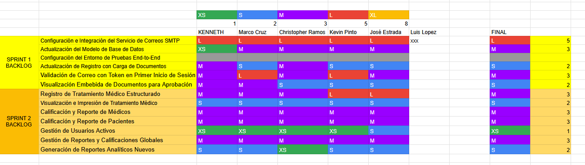
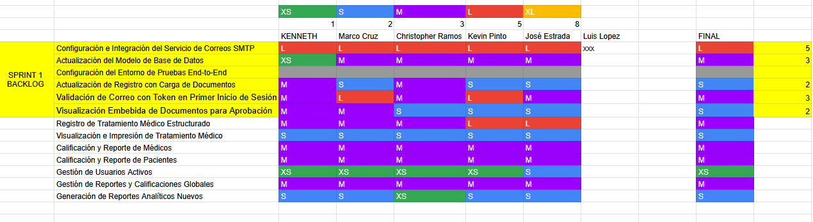
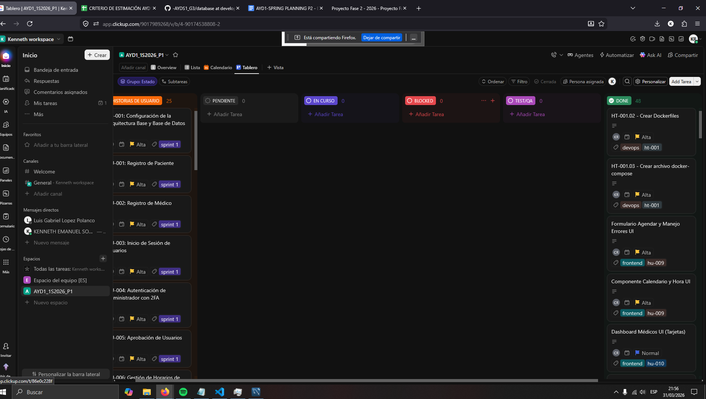
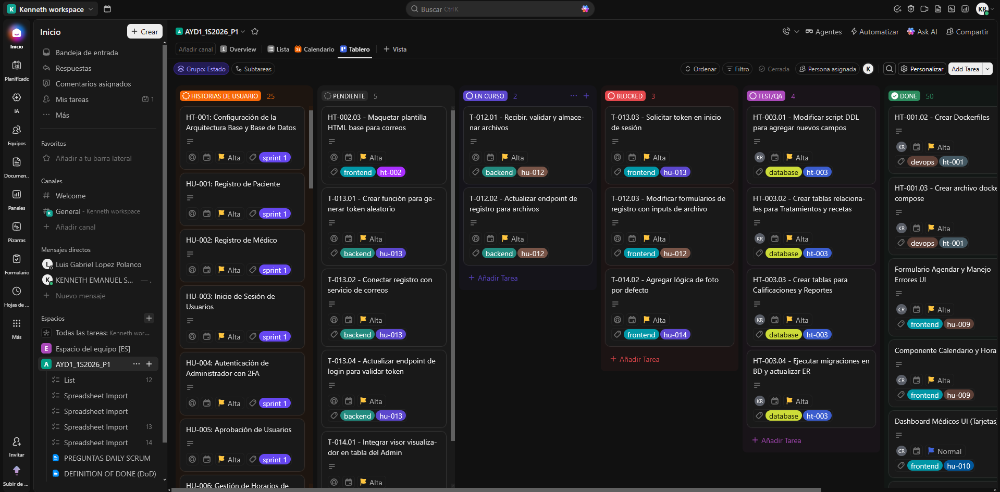

# Gestión Ágil y Scrum PROYECTO 2

## Ceremonias del Sprint 1

### 1. Sprint Planning
Durante el proceso de Sprint Planning 1 se tomó en cuenta los problemas del proyecto 1, así se mejoró la captura del video y del audio.
Durante nuestra reunión de planificación, el equipo analizó las Historias de Usuario y utilizó un cuadro de Excel para estimar el esfuerzo conjunto (utilizando Puntos de Historia/Horas). Estos se encuentran divididos en varios fragmentos para evitar fallas.

**Evidencia de la estimación:**

* *Enlace a la grabación del Planning parte 1:* [https://drive.google.com/file/d/1jRyEuJ-PKYSpNUf0xMDHq4_ESNM-l7QW/view?usp=sharing]
* *Enlace a la grabación del Planning parte 2:* [https://drive.google.com/file/d/159zH40LW9RHLFZL95x0-NuP8USKd7BZ2/view?usp=sharing]
* *Enlace a la grabación del Planning parte 3:* [https://drive.google.com/file/d/1RFSMlfcqAoy6CNtdJj5ifZ2hcxI0qIUX/view?usp=sharing]
* *Enlace a la grabación del Planning parte 4:* [https://drive.google.com/file/d/1_HhyiFcBRU8MEdGaAWY0EeqUT2HmRp58/view?usp=sharing]

---

### 2. Daily Scrums

A continuación se detallan los enlaces de las 6 reuniones diarias realizadas durante el Sprint 1. 

**Roles del equipo para este Sprint:**
* **Kenneth (Product Owner / DevOps / DB)**
* **Kevin (Backend 1)**
* **Jose (Backend 2 / DevOps)**
* **Marco (Frontend 1)**
* **Luis (Frontend 2)**
* **Christopher (Scrum Master / Frontend 3)**

* *Enlace a la grabación de las Daily 1:* [https://drive.google.com/file/d/137Ye7wZQXrgvJVEkMJCobu0sPANFqwln/view?usp=drive_link]
* *Enlace a la grabación de las Daily 2:* [https://drive.google.com/file/d/1EENtirAl_yhq4ZOvKGCSyMv8b2N2LiKa/view?usp=drive_link]
* *Enlace a la grabación de las Daily 3:* [https://drive.google.com/file/d/1f_wWAawMkpMweFfT_5nHc-8DDafyf8I3/view?usp=drive_link]
* *Enlace a la grabación de las Daily 4:* [https://drive.google.com/file/d/1yAgZuWBzuMoiStVrmAdqGJ4fwQ-tF3qV/view?usp=drive_link]
* *Enlace a la grabación de las Daily 5:* [https://drive.google.com/file/d/1pyCJZ4R5Qp8W3eCGHtpuoeuIjX-CWxBb/view?usp=drive_link]
* *Enlace a la grabación de las Daily 6:* [https://drive.google.com/file/d/1shWu9PCDirBkgEhd7Cvyp969suf6weCU/view?usp=drive_link]

---

### 3. Sprint Restrospective
Durante el proceso de Sprint Restrospective todos los miembros del equipo comunicamos las impresiones, cosas mal hechas y a mejorar en el siguiente sprint.
* *Enlace a la grabación del Retrospective:* [https://drive.google.com/file/d/1WSs7miYvSfz6RUiOZz_sgDZTn3zh_m5o/view?usp=sharing]

## Ceremonias del Sprint 2

### 1. Sprint Planning
Durante nuestra reunión de planificación, el equipo analizó las Historias de Usuario y utilizó el cuadro de Excel para estimar el esfuerzo conjunto. 

**Evidencia de la estimación:**

* *Enlace a la grabación del Planning:* [https://drive.google.com/file/d/1ZnTGAGoI8NGxW7zruzl_NjdPQLbBrYTE/view?usp=sharing]

---

### 2. Daily Scrums
* *Enlace a la grabación de las Daily 1:* [https://drive.google.com/file/d/1InYH_wHijR7CzqfAce_fd8-zbP6oBTI8/view?usp=sharing]
* *Enlace a la grabación de las Daily 2:* [https://drive.google.com/file/d/1a-qYnLAQoa4hNt5-TOxSLyf88jkAx83I/view?usp=sharing]

---

### 3. Sprint Restrospective
Durante el proceso de Sprint Restrospective todos los miembros del equipo comunicamos las impresiones, cosas mal hechas y a mejorar en el siguiente proyecto.
* *Enlace a la grabación del Retrospective:* []

## Tablero Kanban y Flujo de Trabajo

Para la gestión de las Historias de Usuario y tareas técnicas de ambos sprints, el equipo utilizó una herramienta de gestión ágil:

* **TO-DO:** Tareas pendientes por iniciar.
* **BLOCKED:** Tareas detenidas por dependencias o impedimentos técnicos.
* **IN PROGRESS:** Tareas en las que los desarrolladores están trabajando activamente.
* **TEST/QA:** Tareas finalizadas en desarrollo que están siendo validadas y probadas.
* **DEPLOY:** Tareas completamente terminadas, aprobadas y listas/desplegadas en la rama principal.

🔗 **Enlace al Tablero Kanban Oficial:** [https://app.clickup.com/9017989268/v/s/90174538808]

---

### Evolución del Tablero - Sprint 1

A continuación se presenta la evidencia visual del movimiento de los tickets a lo largo del primer sprint.

**1. Inicio del Sprint 1**
*El tablero con todas las tareas priorizadas en la columna TO-DO tras el Sprint Planning.*
*(Fecha: 01-03-2026)*

**2. Durante el Desarrollo del Sprint 1**
*Evidencia del trabajo en progreso, tareas en validación (QA) y posibles bloqueos enfrentados por el equipo.*
*(Fecha: 06-03-2026)*

**3. Fin del Sprint 1**
*El tablero al cierre del sprint, evidenciando las tareas completadas en la columna DEPLOY.*
*(Fecha: 09/03/2026)*

---

# Evaluación Scrum Master - Equipo de Desarrollo

| Nombre | Carnet | Evaluación | Justificación |
|--------|--------|------------|--------------|
| Luis Gabriel López Polanco | 202001523 | 98 | Participó activamente en todas las reuniones de Scrum, demostrando puntualidad, responsabilidad y compromiso constante con el equipo. En esta segunda fase evidenció una mejora en su comunicación, facilitando la coordinación entre los integrantes. Además, contribuyó significativamente en el desarrollo de la vista del administrador en el frontend, aportando al avance general del sistema. |
| Christopher Miguel Ángel Ramos Ascencio | 202200057 | 97 | Desempeñó el rol de Scrum Master, organizando y coordinando las reuniones de manera efectiva. Promovió un ambiente de participación activa y compañerismo, evitando la monotonía en las sesiones. Fue responsable de la grabación de reuniones; sin embargo, debido a un inconveniente técnico, las últimas fueron apoyadas por el compañero Kenneth. Su liderazgo fue clave en la dinámica del equipo. |
| Kevin Ricardo Pinto Montenegro | 201403885 | 98 | Integrante comprometido con las reuniones de Scrum, destacando por su participación activa y constante. Fue uno de los principales responsables del backend, aportando soluciones técnicas y colaborando en la implementación de funcionalidades clave. Su trabajo fue fundamental para el desarrollo del sistema. |
| José Manuel Estrada Gutiérrez | 201907078 | 95 | Integrante con mucha experiencia en programación backend, reflejada en la calidad de sus aportes técnicos. Aunque su participación en algunas reuniones de sprint fue limitada, contribuyó de manera importante en el desarrollo, la configuración de la instancia EC2 y el despliegue del sistema, siendo un apoyo técnico clave. |
| Marco Fernando Cruz Mendoza | 202001070 | 98 | Participó constantemente en las reuniones, destacando en el reporte de avances del frontend. A pesar de dificultades técnicas con su micrófono, siempre buscó la forma de comunicar sus avances, dudas y bloqueos. Su compromiso y responsabilidad fueron evidentes durante el proyecto. |
| Kenneth Emanuel Solís Ramírez | 201807102 | 98 | Desempeñó eficientemente su rol como Project Manager, mostrando liderazgo y alta participación en las reuniones. Fue uno de los integrantes más constantes y apoyó adicionalmente con la grabación de sesiones cuando fue necesario, demostrando compromiso más allá de sus responsabilidades principales. |

## Conclusión
El equipo en general demostró un alto nivel de compromiso, colaboración y responsabilidad durante el desarrollo del proyecto, logrando un equilibrio entre las áreas de frontend, backend y gestión bajo la metodología Scrum.