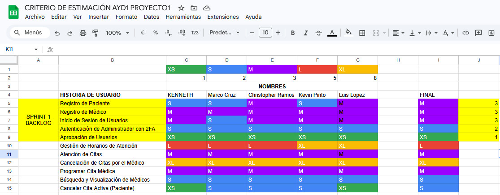
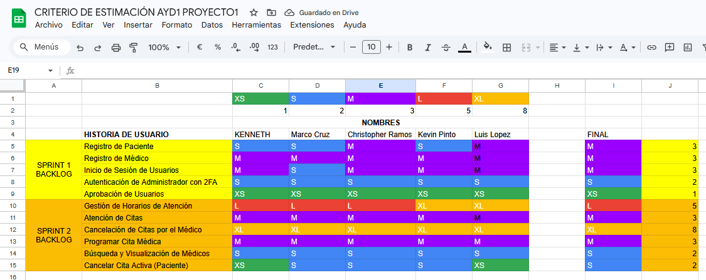
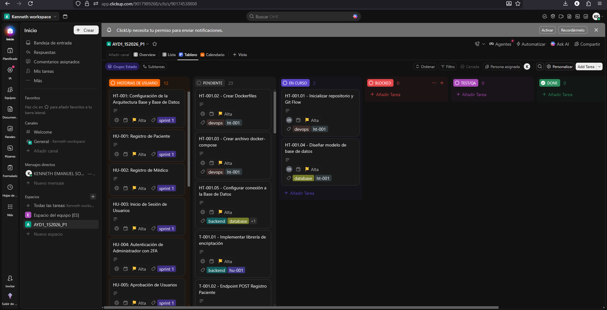
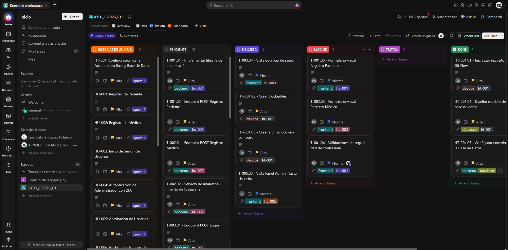
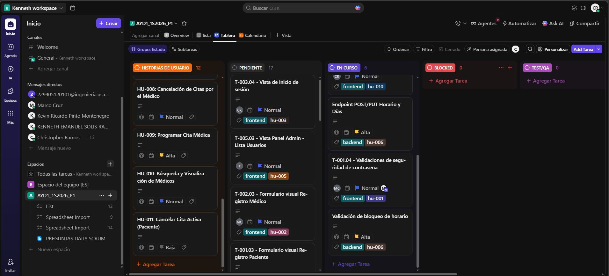
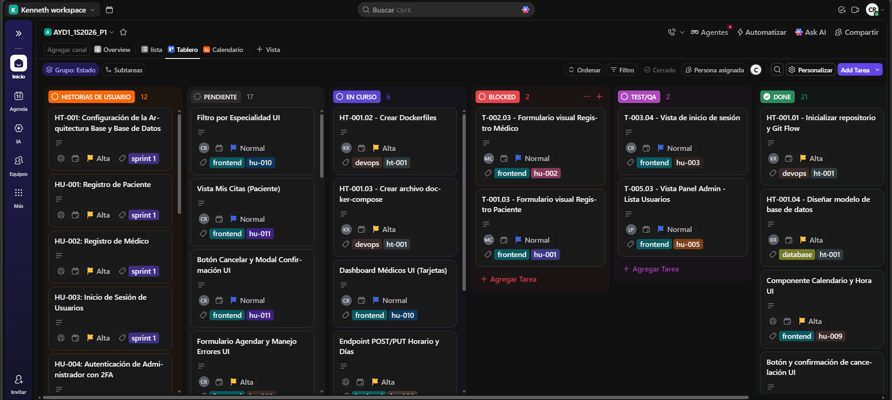
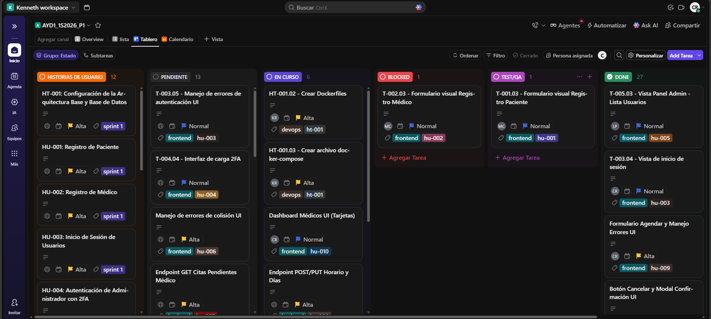
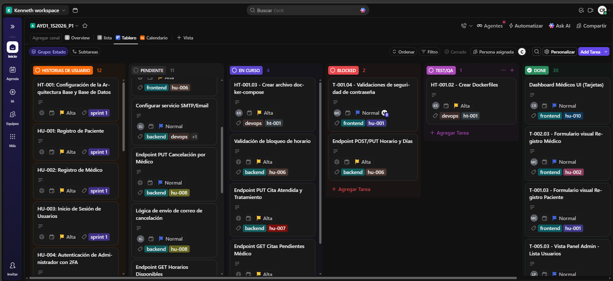

# Gestión Ágil y Scrum

## Ceremonias del Sprint 1

### 1. Sprint Planning
Durante el proceso de Sprint Planning 1 se tuvieron varios inconvenientes técnicos y de coordinación los cuales se solucionaron en sprint 2.
Durante nuestra reunión de planificación, el equipo analizó las Historias de Usuario y utilizó un cuadro de Excel para estimar el esfuerzo conjunto (utilizando Puntos de Historia/Horas). 

**Evidencia de la estimación:**

* *Enlace a la grabación del Planning:* [https://drive.google.com/file/d/1HwXYQ8k_kIsjGCXjkYLQEuLk6uzOFbOr/view?usp=sharing]
* *Fragmento del Planning 1:* [https://drive.google.com/file/d/12g-aSOS0LpRJG8txfxecHgbzS5VfW2Ay/view?usp=drive_link]
* *Asignación tareas:* [https://drive.google.com/file/d/1p0kKx8Tgw3ti4xhIxVvAyNIfDZzZWlnz/view?usp=drive_link]

---

### 2. Daily Scrums

A continuación se detalla la bitácora de las 6 reuniones diarias (Daily Scrums) realizadas durante el Sprint 1. 

**Roles del equipo para este Sprint:**
* **Kenneth (Product Owner / DevOps / DB)**
* **Kevin (Backend 1)**
* **Jose (Backend 2 / DevOps)**
* **Marco (Frontend 1)**
* **Luis (Frontend 2)**
* **Christopher (Scrum Master / Frontend 3)**

---

### Daily Scrum 1
**Fecha:** 02-03-2026 | **Duración:** 15 min

* **Kenneth:** * *Ayer:* N/A (Inicio de Sprint).
  * *Hoy:* Trabajaré en la **HT-001**, inicializando el repositorio con Git Flow y creando el `docker-compose.yml`.
  * *Bloqueos:* Ninguno, esperando que todos clonen el repo.
* **Kevin:**
  * *Ayer:* N/A.
  * *Hoy:* Empezaré con la **HU-001**, investigando e implementando la librería `bcrypt` en FastAPI para la encriptación.
  * *Bloqueos:* Ninguno.
* **Jose:**
  * *Ayer:* N/A.
  * *Hoy:* Iniciaré el modelo relacional en el backend y prepararé el endpoint POST para la **HU-002** (Registro de Médico).
  * *Bloqueos:* Dependo de que Kenneth suba el contenedor de la BD.
* **Marco:**
  * *Ayer:* N/A.
  * *Hoy:* Configuración inicial de Vite/React y creación del maquetado visual del formulario de paciente (**HU-001**).
  * *Bloqueos:* Ninguno.
* **Luis:**
  * *Ayer:* N/A.
  * *Hoy:* Crearé los componentes base y el formulario visual para el registro de médicos (**HU-002**).
  * *Bloqueos:* Ninguno.
* **Christopher (SM):**
  * *Ayer:* N/A.
  * *Hoy:* Como SM, aseguraré que el tablero de ClickUp esté actualizado. Apoyaré en el Frontend creando la vista de Login (**HU-003**).
  * *Bloqueos:* Ninguno.

---

### Daily Scrum 2
**Fecha:** 03-03-2026 | **Duración:** 11 min

* **Kenneth:** * *Ayer:* Finalicé el `docker-compose` y la estructura base.
  * *Hoy:* Diseñaré el modelo de base de datos final (`schema.sql`) para todas las entidades y lo integraré al contenedor (**HT-001**).
  * *Bloqueos:* Ninguno.
* **Kevin:**
  * *Ayer:* Configuré `bcrypt` correctamente.
  * *Hoy:* Programaré el endpoint POST de registro de paciente y lo conectaré a la base de datos (**HU-001**).
  * *Bloqueos:* Ninguno.
* **Jose:**
  * *Ayer:* Dejé la estructura base del registro de médico lista.
  * *Hoy:* Implementaré el servicio para recibir y almacenar la fotografía obligatoria del médico en el backend (**HU-002**).
  * *Bloqueos:* Tuve problemas con el manejo de archivos multipart, pero ya estoy leyendo la documentación.
* **Marco:**
  * *Ayer:* Terminé la UI del formulario de paciente.
  * *Hoy:* Trabajaré en las validaciones de seguridad de la contraseña en el frontend (mayúsculas, minúsculas, números) (**HU-001**).
  * *Bloqueos:* Ninguno.
* **Luis:**
  * *Ayer:* Avancé un 80% en el formulario de médicos.
  * *Hoy:* Finalizaré el formulario agregando el input para subir la fotografía y validando los campos (**HU-002**).
  * *Bloqueos:* Ninguno.
* **Christopher (SM):**
  * *Ayer:* Terminé la maquetación del Login.
  * *Hoy:* Revisaré que las ramas en Git se estén usando bien. Empezaré la interfaz de redirección para el Administrador (**HU-004**).
  * *Bloqueos:* Ninguno.

---

### Daily Scrum 3
**Fecha:** 04-03-2026 | **Duración:** 13 min

* **Kenneth:** * *Ayer:* Terminé el modelo SQL y la BD ya está corriendo en Docker.
  * *Hoy:* Inyectaré los datos semilla (data.sql) con el usuario administrador predeterminado (**HU-004**).
  * *Bloqueos:* Ninguno.
* **Kevin:**
  * *Ayer:* Terminé el endpoint de registro de paciente.
  * *Hoy:* Empezaré el endpoint POST de Inicio de Sesión (**HU-003**), validando correos y contraseñas.
  * *Bloqueos:* Ninguno.
* **Jose:**
  * *Ayer:* Logré guardar la imagen del médico en el servidor local.
  * *Hoy:* Trabajaré en el endpoint para que el backend reciba y lea el archivo `auth2-ayd1.txt` del administrador (**HU-004**).
  * *Bloqueos:* Ninguno.
* **Marco:**
  * *Ayer:* Validaciones de contraseña de paciente listas.
  * *Hoy:* Conectaré el formulario de paciente con el endpoint de Kevin mediante `fetch/axios` (**HU-001**).
  * *Bloqueos:* CORS me estaba dando error, Kenneth me ayudará a configurarlo en FastAPI.
* **Luis:**
  * *Ayer:* Formulario de médico terminado visualmente.
  * *Hoy:* Empezaré a desarrollar la vista del panel del administrador para listar usuarios (**HU-005**).
  * *Bloqueos:* Necesito que el backend tenga listos los endpoints GET.
* **Christopher (SM):**
  * *Ayer:* Interfaz del admin lista.
  * *Hoy:* Añadiré lógica en el frontend del Login para mostrar los mensajes de error si la autenticación falla (**HU-003**).
  * *Bloqueos:* Ninguno.

---

### Daily Scrum 4
**Fecha:** 05-03-2026 | **Duración:** 10 min

* **Kenneth:** * *Ayer:* Datos semilla listos y CORS arreglado.
  * *Hoy:* Revisaré los logs de los contenedores porque a Jose le dio un error de conexión a BD, haré troubleshooting.
  * *Bloqueos:* Ninguno.
* **Kevin:**
  * *Ayer:* Endpoint de inicio de sesión casi listo.
  * *Hoy:* Añadiré la lógica en el login para verificar que el estado del usuario sea "Aprobado" antes de dejarlo entrar (**HU-003**).
  * *Bloqueos:* Ninguno.
* **Jose:**
  * *Ayer:* Endpoint de subida de TXT funcionando.
  * *Hoy:* Implementaré la lógica de validación 2FA comparando la contraseña encriptada del archivo TXT con la de la BD (**HU-004**).
  * *Bloqueos:* Ninguno.
* **Marco:**
  * *Ayer:* Registro de pacientes conectado exitosamente al backend.
  * *Hoy:* Apoyaré a Luis conectando el formulario de médicos con el endpoint de Jose que recibe imágenes (**HU-002**).
  * *Bloqueos:* Ninguno.
* **Luis:**
  * *Ayer:* Maquetación de tabla de usuarios en panel admin lista.
  * *Hoy:* Integraré los botones de "Aceptar" y "Rechazar" en la vista del administrador (**HU-005**).
  * *Bloqueos:* A la espera de los endpoints de Kevin/Jose.
* **Christopher (SM):**
  * *Ayer:* Lógica de errores en el Login finalizada.
  * *Hoy:* Crearé el componente visual para que el administrador pueda subir su archivo `auth2-ayd1.txt` (**HU-004**).
  * *Bloqueos:* Ninguno.

---

### Daily Scrum 5
**Fecha:** 06-03-2026 | **Duración:** 8 min

* **Kenneth:** * *Ayer:* Errores de BD resueltos.
  * *Hoy:* Crear los `Dockerfile` finales para Frontend y Backend y asegurar que el `docker-compose` levante todo el proyecto de golpe.
  * *Bloqueos:* Ninguno.
* **Kevin:**
  * *Ayer:* Login terminado con validación de estado.
  * *Hoy:* Crearé los endpoints GET y PUT para listar a los usuarios pendientes y actualizar su estado a Aprobado/Rechazado (**HU-005**).
  * *Bloqueos:* Ninguno.
* **Jose:**
  * *Ayer:* 2FA de Administrador terminado a nivel backend.
  * *Hoy:* Revisión de código (Code Review) con Kevin y pruebas en Postman de todos los flujos de autenticación.
  * *Bloqueos:* Ninguno.
* **Marco:**
  * *Ayer:* Registro de médicos conectado y enviando imágenes correctamente.
  * *Hoy:* Pruebas de integración del Login en el frontend consumiendo el endpoint de Kevin (**HU-003**).
  * *Bloqueos:* Ninguno.
* **Luis:**
  * *Ayer:* Botones Aceptar/Rechazar en UI listos.
  * *Hoy:* Consumir los endpoints de Kevin para poblar la tabla del admin y hacer funcionales los botones de cambio de estado (**HU-005**).
  * *Bloqueos:* Ninguno.
* **Christopher (SM):**
  * *Ayer:* Vista 2FA de admin terminada.
  * *Hoy:* Conectaré la vista de subida del archivo TXT con el endpoint de Jose y haré pruebas de flujo completo de Admin (**HU-004**).
  * *Bloqueos:* Ninguno.

---

### Daily Scrum 6 (Cierre de Sprint)
**Fecha:** 07-03-2026 | **Duración:** 8 min

* **Kenneth:** * *Ayer:* Dockerización completada con éxito.
  * *Hoy:* Revisar que todos los PRs (Pull Requests) estén fusionados en `develop` y probar que la app levante de cero.
  * *Bloqueos:* Ninguno.
* **Kevin:**
  * *Ayer:* Endpoints de aprobación terminados.
  * *Hoy:* Documentar brevemente mis endpoints y asistir a Luis si hay algún bug en el panel de administrador.
  * *Bloqueos:* Ninguno.
* **Jose:**
  * *Ayer:* Pruebas en Postman exitosas.
  * *Hoy:* Limpieza de código muerto, comentarios y preparación para la Sprint Review.
  * *Bloqueos:* Ninguno.
* **Marco:**
  * *Ayer:* Login 100% funcional.
  * *Hoy:* Ajustes menores de CSS y apoyo en las pruebas generales de la plataforma.
  * *Bloqueos:* Ninguno.
* **Luis:**
  * *Ayer:* Integración del panel de admin terminada. Funciona el cambio de estado.
  * *Hoy:* Corrección de bugs menores visuales al rechazar a un usuario. Preparando demo.
  * *Bloqueos:* Ninguno.
* **Christopher (SM):**
  * *Ayer:* Flujo de 2FA funcionando perfectamente en el frontend.
  * *Hoy:* Moveré las tarjetas a "Done" en ClickUp, validaré los criterios de aceptación de todas las HU y prepararé todo para la reunión de Retrospectiva.
  * *Bloqueos:* Ninguno, ¡listos para el cierre!

---

### 3. Sprint Restrospective
Durante el proceso de Sprint Restrospective todos los miembros del equipo comunicamos las impresiones, cosas mal hechas y a mejorar en el siguiente sprint.
* *Enlace a la grabación del Retrospective:* [https://drive.google.com/file/d/1ZOUjCCVGChDc4gkZG7ppHDlZkQwdOXDm/view?usp=drive_link]

## Ceremonias del Sprint 2

### 1. Sprint Planning
Durante nuestra reunión de planificación, el equipo analizó las Historias de Usuario y utilizó un cuadro de Excel para estimar el esfuerzo conjunto. 

**Evidencia de la estimación:**

* *Enlace a la grabación del Planning:* [https://drive.google.com/file/d/1nLYSazer0_n-5GjnQgwJy74irTptIjP8/view?usp=drive_link]

---

### 2. Daily Scrums
* *Enlace a la grabación de las Daily 1:* [https://drive.google.com/file/d/137Ye7wZQXrgvJVEkMJCobu0sPANFqwln/view?usp=drive_link]
* *Enlace a la grabación de las Daily 2:* [https://drive.google.com/file/d/1EENtirAl_yhq4ZOvKGCSyMv8b2N2LiKa/view?usp=drive_link]
* *Enlace a la grabación de las Daily 3:* [https://drive.google.com/file/d/1f_wWAawMkpMweFfT_5nHc-8DDafyf8I3/view?usp=drive_link]
* *Enlace a la grabación de las Daily 4:* [https://drive.google.com/file/d/1yAgZuWBzuMoiStVrmAdqGJ4fwQ-tF3qV/view?usp=drive_link]
* *Enlace a la grabación de las Daily 5:* [https://drive.google.com/file/d/1pyCJZ4R5Qp8W3eCGHtpuoeuIjX-CWxBb/view?usp=drive_link]
* *Enlace a la grabación de las Daily 6:* [https://drive.google.com/file/d/1shWu9PCDirBkgEhd7Cvyp969suf6weCU/view?usp=drive_link]

---

### 3. Sprint Restrospective
Durante el proceso de Sprint Restrospective todos los miembros del equipo comunicamos las impresiones, cosas mal hechas y a mejorar en el siguiente proyecto.
* *Enlace a la grabación del Retrospective:* [https://drive.google.com/file/d/1DkehHhnP7hmKydwq301FcDc5OfpCcizs/view?usp=drive_link]

## Tablero Kanban y Flujo de Trabajo

Para la gestión de las Historias de Usuario y tareas técnicas de ambos sprints, el equipo utilizó una herramienta de gestión ágil:

* **TO-DO:** Tareas pendientes por iniciar.
* **BLOCKED:** Tareas detenidas por dependencias o impedimentos técnicos.
* **IN PROGRESS:** Tareas en las que los desarrolladores están trabajando activamente.
* **TEST/QA:** Tareas finalizadas en desarrollo que están siendo validadas y probadas.
* **DEPLOY:** Tareas completamente terminadas, aprobadas y listas/desplegadas en la rama principal.

🔗 **Enlace al Tablero Kanban Oficial:** [https://app.clickup.com/9017989268/v/s/90174538808]

---

### Evolución del Tablero - Sprint 1

A continuación se presenta la evidencia visual del movimiento de los tickets a lo largo del primer sprint.

**1. Inicio del Sprint 1**
*El tablero con todas las tareas priorizadas en la columna TO-DO tras el Sprint Planning.*
*(Fecha: 01-03-2026)*

**2. Durante el Desarrollo del Sprint 1**
*Evidencia del trabajo en progreso, tareas en validación (QA) y posibles bloqueos enfrentados por el equipo.*
*(Fecha: 06-03-2026)*

**3. Fin del Sprint 1**
*El tablero al cierre del sprint, evidenciando las tareas completadas en la columna DEPLOY.*
*(Fecha: 09/03/2026)*

---

### Evolución del Tablero - Sprint 2

Evidencia del flujo de trabajo continuo durante el segundo sprint, enfocado en el núcleo de la aplicación (Citas Médicas).

**4. Inicio del Sprint 2**
*Nuevas tareas cargadas desde el Product Backlog a la columna TO-DO.*
*(Fecha: 12-03-2026 )*

**5. Durante el Desarrollo del Sprint 2**
*Movimiento constante de tickets y colaboración del equipo reflejada en las columnas IN PROGRESS y TEST/QA.*
*(Fecha: 18-03-2026)*

**6. Fin del Sprint 2**
*Cierre del proyecto con las tareas requeridas movidas a la columna DEPLOY.*
*(Fecha: 20-03-2026)*

## Calificación del Equipo (Scrum Master)

A continuación, se presenta la evaluación de desempeño de cada integrante del equipo de desarrollo durante los sprint Sprint:

| Integrante | Carnet | Evaluación | Justificación |
| :--- | :--- | :---: | :--- |
| **Luis Gabriel López Polanco** | 202001523 | **94** | Participó en todas las reuniones SCRUM, mostrando puntualidad y compromiso constante. En cada daily expuso los avances logrados o sus bloqueos en caso de haberlos. Su aporte en las reuniones se reflejó en la vista del administrador en el frontend, entregando en cada daily avances en sus funcionalidades. Aunque gran parte de su trabajo se concentró en la fase final del proyecto, cumplió con lo asignado y demostró responsabilidad. Además fomentó un ambiente positivo y agradable durante todas las reuniones. |
| **Christopher Miguel Angel Ramos Ascencio** | 202200057 | **95** | Como Scrum Master lideré todas las reuniones, asegurando su continuidad y cumplimiento de los objetivos. Ayudé a promover un ambiente colaborativo y amigable, evitando que las reuniones con mi grupo fueran excesivamente rígidas o aburridas, lo que favoreció la participación activa del equipo. Me encargué de grabar las sesiones para mantener evidencia y facilitar retroalimentación. Además de cumplir como Scrum Master, contribuí directamente al desarrollo en el frontend, implementando las vistas de médicos y paciente junto con sus funcionalidades. |
| **Kevin Ricardo Pinto Montenegro** | 201403885 | **94** | Integrante siempre comprometido con las reuniones a pesar de la carga laboral con la que cuenta. Participó activamente en las primeras cuatro reuniones diarias, mostrando disposición para apoyar al equipo con sugerencias y posibles soluciones. Aunque sus avances en el backend fueron menos comprobables debido a compromisos laborales externos (que nosotros como compañeros entendemos), su actitud colaborativa y compromiso con el equipo fueron constantes, aun cuando las circunstancias limitaron su disponibilidad. |
| **Jose Manuel Estrada Gutierrez** | 201907078 | **95** | Integrante que a pesar de tener complicaciones personales nunca abandonó sus responsabilidades con el grupo. Cumplió con su parte del backend, demostrando avances verificables mediante el tablero de ClickUp en cada Sprint. A pesar de no poder asistir a muchas reuniones de daily, los integrantes damos fe de que sus avances fueron esenciales para que los demás del grupo no tuviéramos bloqueos. |
| **Marco Fernando Cruz Mendoza** | 202001076 | **95** | Fue pilar fundamental en el inicio de nuestro proyecto ayudando a sentar las bases del frontend. Integrante que asistió a todas y cada una de las reuniones daily. Siempre puntual y siempre dando buenos reportes de sus avances en el día a día. Por sus complicaciones en temas de micrófono era poco participativo, sin embargo respondía correctamente las preguntas. Siempre demostró ser de los primeros en mostrar avances comprobables del proyecto. |
| **Kenneth Emanuel Solís Ramírez** | 201807102 | **97** | Fue el miembro más atento y constante en todas las reuniones, mostrando un alto nivel de compromiso y participación. Reportó sus avances con claridad y, además de entregar su parte, apoyó a algunos compañeros que tenían bloqueos. Hizo muy bien su rol de “Project Manager”, proporcionando un tablero bien estructurado en ClickUp con historias de usuario claramente identificadas, lo que nos facilitó la organización y seguimiento del proyecto. Su actitud tan activa y disposición para apoyar a compañeros lo convirtieron en uno de los integrantes más valiosos y participativos del grupo. |