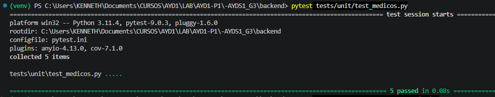
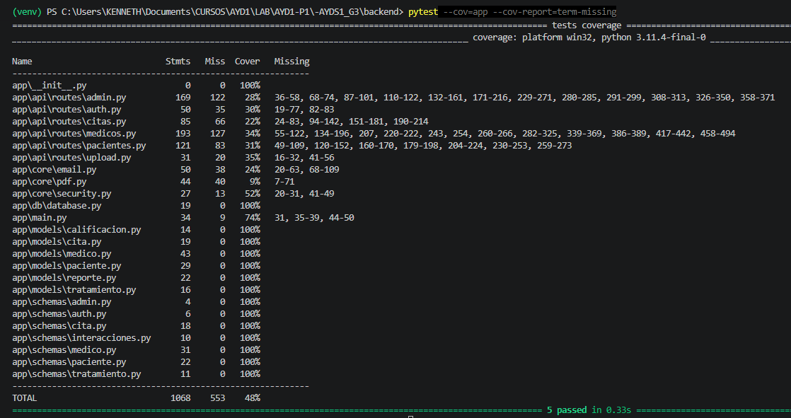

# Documentación de Pruebas Unitarias - Módulo de Médicos

**Ubicación de tests:** `backend/tests/unit/`

---

## Pruebas de API Médicos (5 tests)

**Comando para ejecutar todos los tests del módulo:**
```bash
pytest tests/unit/test_medicos.py
```

---

## Test 1: Obtener Perfil - Acceso Denegado (Protección de Rutas)

### Caso de Prueba
**Descripción:** Valida que el sistema rechaza la petición a una ruta protegida (`/perfil`) si el usuario autenticado no tiene el rol de "medico" (ej. es un paciente).

**Entrada:**
- Endpoint: `GET /perfil`
- Token simula rol: "paciente"

**Técnicas utilizadas:**
- Dependency Overrides de FastAPI (`app.dependency_overrides`)
- Mocks de dependencias (simulación de la función `verificar_token`)

**Datos de prueba:**
- `verificar_token()` → devuelve `{"rol": "paciente", "id": 99}`

### Resultado Esperado
```
PASS  tests/unit/test_medicos.py
  Test 1
    √ test_obtener_perfil_medico_acceso_denegado
```


---

## Test 2: Obtener Perfil - Médico No Encontrado

### Caso de Prueba
**Descripción:** Valida el manejo de errores cuando un token es válido (rol médico), pero el ID asociado no existe en la base de datos.

**Entrada:**
- Endpoint: `GET /perfil`
- Token simula rol: "medico", id: 1

**Técnicas utilizadas:**
- Mocks para la Base de Datos (`MagicMock` de `unittest.mock`)
- Inyección de dependencias falsa (`get_db`)

**Datos de prueba:**
- `verificar_token()` → devuelve `{"rol": "medico", "id": 1}`
- `db.query().filter().first()` → devuelve `None`

### Resultado Esperado
```
PASS  tests/unit/test_medicos.py
  Test 2
    √ test_obtener_perfil_medico_no_encontrado
```

---

## Test 3: Registrar Tratamiento - Cita Inexistente

### Caso de Prueba
**Descripción:** Valida que el sistema no permite guardar un tratamiento médico si el identificador de la cita proporcionada no existe.

**Entrada:**
- Endpoint: `POST /tratamiento`
- Payload: `{"id_cita": 999, "diagnostico": "Gripe común", "medicamentos": []}`

**Técnicas utilizadas:**
- Mock de sesión de SQLAlchemy
- Validación de excepciones y status codes HTTP (404 Not Found)

**Datos de prueba:**
- Búsqueda de cita en base de datos (`first()`) → devuelve `None`

### Resultado Esperado
```
PASS  tests/unit/test_medicos.py
  Test 3
    √ test_registrar_tratamiento_cita_no_existe
```

---

## Test 4: Atender Cita - Estado Incorrecto

### Caso de Prueba
**Descripción:** Valida la lógica de negocio que impide modificar o "atender" una cita que ya fue finalizada previamente (estado distinto a Pendiente).

**Entrada:**
- Endpoint: `PUT /citas/1/atender`
- Payload: `{"tratamiento": "Reposo por 3 días"}`

**Técnicas utilizadas:**
- Creación de un objeto `MagicMock` simulando ser el modelo `Cita` de la DB.
- Recreación de estados (`EstadoCitaEnum`).

**Datos de prueba:**
- `verificar_token()` → devuelve `{"rol": "medico", "id": 1}`
- Búsqueda en DB → devuelve objeto Cita con `estado = EstadoCitaEnum.Atendida`

### Resultado Esperado
```
PASS  tests/unit/test_medicos.py
  Test 4
    √ test_atender_cita_estado_incorrecto
```

---

## Test 5: Obtener Citas Pendientes - Respuesta Vacía Exitosa

### Caso de Prueba
**Descripción:** Valida que la ruta de historial funciona correctamente y devuelve un array JSON vacío cuando el médico no tiene citas pendientes, en lugar de provocar un error en el servidor.

**Entrada:**
- Endpoint: `GET /citas/pendientes`

**Técnicas utilizadas:**
- Mocks para métodos que devuelven colecciones (`.all()`)
- Aserción de contenido de respuesta y status code (200 OK)

**Datos de prueba:**
- `verificar_token()` → devuelve `{"rol": "medico", "id": 1}`
- `db.query().filter().all()` → devuelve `[]` (lista vacía)

### Resultado Esperado
```
PASS  tests/unit/test_medicos.py
  Test 5
    √ test_obtener_citas_pendientes_vacia_exito
```


---

## Resumen de Tests

| Numero | Archivo | Test | Comando de Ejecucion | Status |
|--------|---------|------|----------------------|--------|
| 1 al 5 | test_medicos.py | Validaciones de Módulo Médico (Roles, DB, Lógica Citas) | `pytest tests/unit/test_medicos.py` | PASS |

### Resultado Obtenido


---

## Ejecución General de la Suite y Cobertura

Para ejecutar todos los tests y ver el reporte de líneas faltantes por probar:
```bash
pytest --cov=app --cov-report=term-missing
```

### Resultado Obtenido

