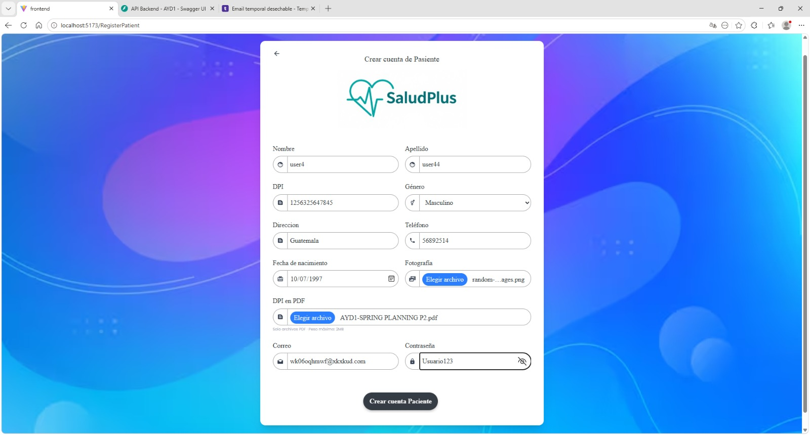
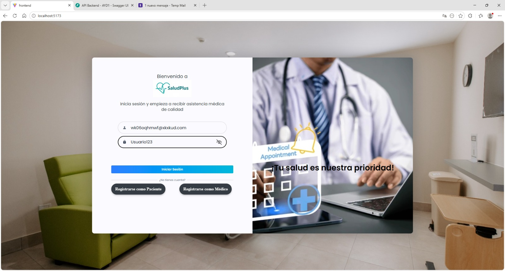
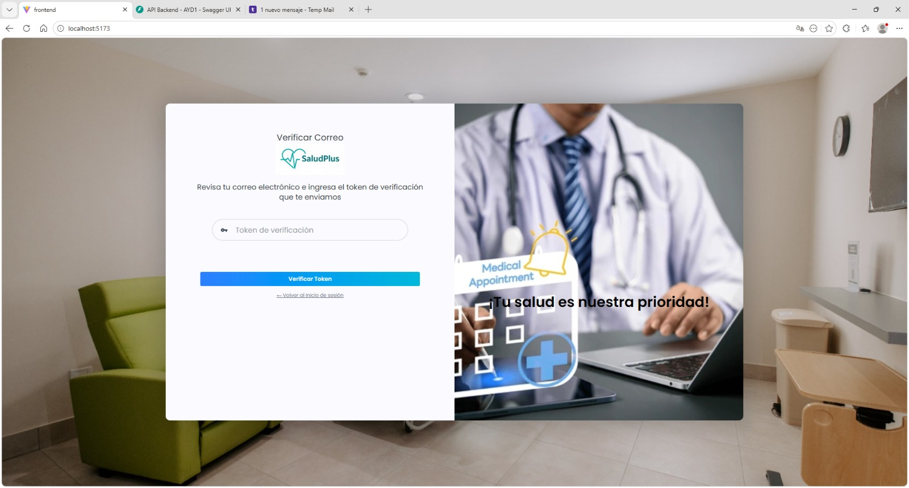
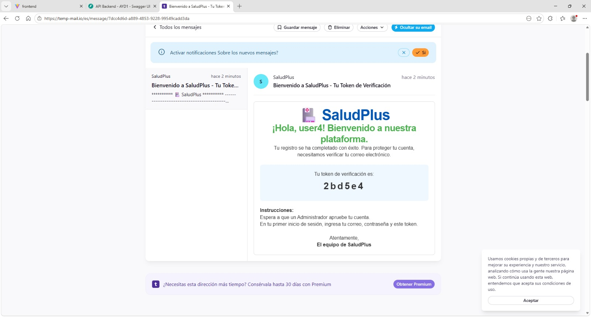
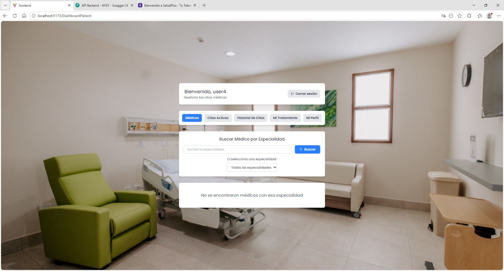
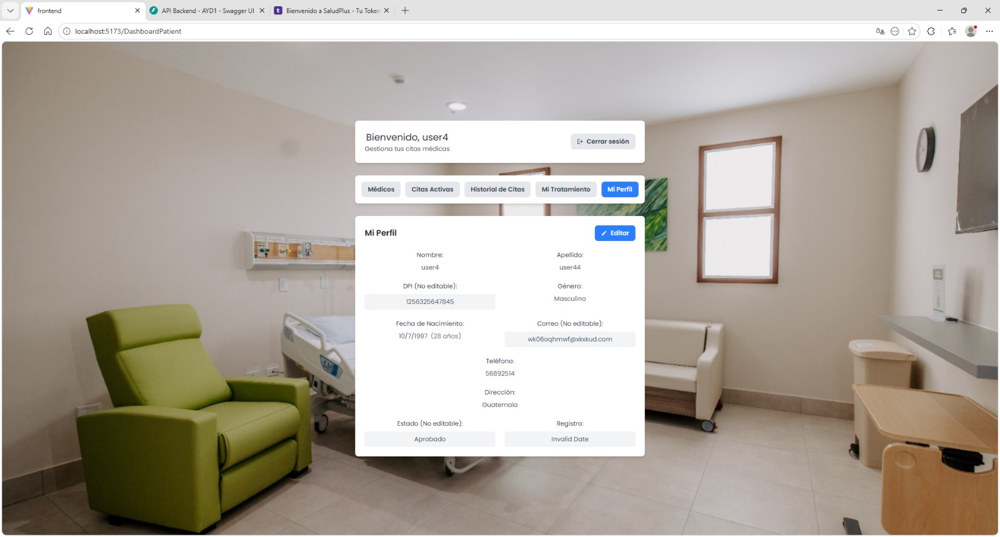
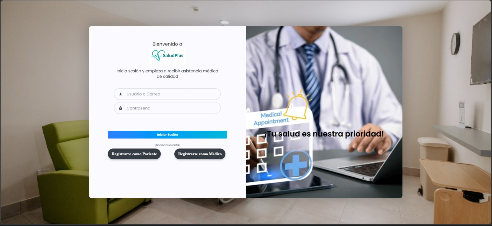

# Documentación de Pruebas End-to-End - Proyecto SaludPlus

Pruebas end-to-end ejecutadas para validar el flujo completo de autenticación, registro y gestión básica del usuario dentro de la aplicación.

---

## Prueba 1: Registro de Usuario (Paciente)
**Código:** `01-registro.cy.js`

**Descripción:**  
Valida el proceso de creación de cuenta para un nuevo usuario. Se verifica que, al iniciar la aplicación, el usuario pueda navegar correctamente al apartado de registro y completar el formulario como paciente. La prueba asegura que los campos obligatorios (nombre, correo, contraseña, etc.) sean aceptados correctamente y que el sistema registre al usuario sin errores.

**Captura de ejecución:** Registro de usuario exitoso

  

---

## Prueba 2: Inicio de Sesión
**Código:** `02-login.cy.js`

**Descripción:**  
Valida que un usuario previamente registrado y aprobado por el administrador pueda iniciar sesión en la aplicación. Se verifica que el sistema autentique correctamente las credenciales ingresadas y redirija al flujo de validación correspondiente.

**Captura de ejecución:** Inicio de sesión

  

---

## Prueba 3: Redirección a Validación por Correo
**Código:** `03-validacion-correo.cy.js`

**Descripción:**  
Verifica que, tras intentar iniciar sesión, el usuario sea redirigido automáticamente al módulo de validación de token. Esta prueba asegura que el sistema active correctamente el segundo factor de autenticación mediante correo electrónico.

**Captura de ejecución:** Pantalla de validación de correo

  

---

## Prueba 4: Ingresar Token de Verificación
**Código:** `04-token-correo.cy.js`

**Descripción:**  
Valida el proceso de envío de correo electrónico con el token de verificación. Se verifica que el usuario reciba un mensaje desde la plataforma SaludPlus con un código único, el cual será utilizado para completar la autenticación. Este proceso garantiza la seguridad mediante validación de identidad.

**Captura de ejecución:** Correo con token recibido

  

---

## Prueba 5: Verificación de Token
**Código:** `05-verificar-token.cy.js`

**Descripción:**  
Valida que el usuario pueda ingresar correctamente el token recibido en el apartado de validación. Se verifica que el sistema acepte el código, complete el proceso de autenticación y permita el acceso a la aplicación. Este paso se ejecuta únicamente en el primer inicio de sesión o cuando se requiere verificación adicional.

**Captura de ejecución:** Token validado correctamente

  

---

## Prueba 6: Acceso a Página Principal
**Código:** `06-dashboard.cy.js`

**Descripción:**  
Verifica que, una vez autenticado, el usuario sea redirigido a la página principal (dashboard). Se valida que los componentes clave estén visibles y funcionales, como la búsqueda de médicos por especialidad, visualización de citas activas y acceso al historial de citas.

**Captura de ejecución:** Dashboard principal

  

---

## Prueba 7: Gestión de Perfil de Usuario
**Código:** `07-perfil.cy.js`

**Descripción:**  
Valida que el usuario pueda acceder a su perfil, visualizar su información personal y realizar modificaciones en los campos permitidos. Se verifica que los cambios se guarden correctamente y se reflejen en la interfaz sin inconsistencias.

**Captura de ejecución:** Edición de perfil

  

---

## Prueba 8: Cierre de Sesión
**Código:** `08-logout.cy.js`

**Descripción:**  
Valida que el usuario pueda cerrar sesión correctamente desde la aplicación. Se verifica que la sesión se invalide y que el sistema redirija al usuario a la pantalla de inicio de sesión. Además, se comprueba que en futuros accesos no sea necesario repetir la validación por token, salvo que el sistema lo requiera por seguridad.

**Captura de ejecución:** Cierre de sesión exitoso

  

---

## Resumen

| Número | Archivo                     | Test                          | Tipo      |
|--------|----------------------------|-------------------------------|-----------|
| 1      | 01-registro.cy.js          | Registro de usuario           | Flujo     |
| 2      | 02-login.cy.js             | Inicio de sesión              | Flujo     |
| 3      | 03-validacion-correo.cy.js | Redirección a validación      | Flujo     |
| 4      | 04-token-correo.cy.js      | Recepción de token            | Seguridad |
| 5      | 05-verificar-token.cy.js   | Validación de token           | Seguridad |
| 6      | 06-dashboard.cy.js         | Acceso a página principal     | Flujo     |
| 7      | 07-perfil.cy.js            | Gestión de perfil             | CRUD      |
| 8      | 08-logout.cy.js            | Cierre de sesión              | Flujo     |